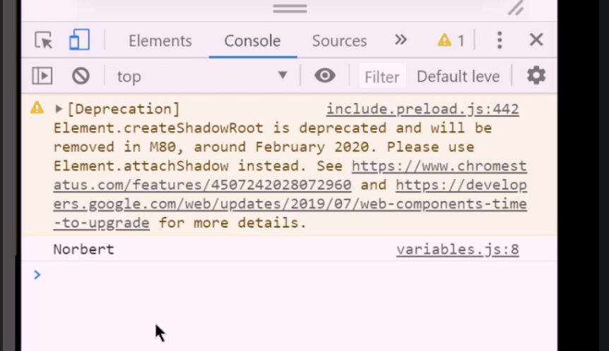
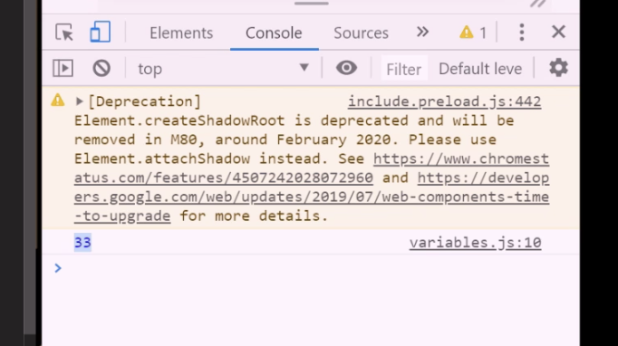
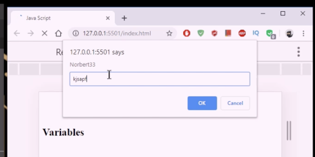
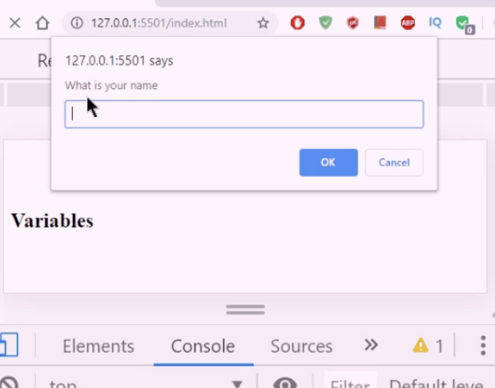

# 2. JS Variables

See [this codepen](https://codepen.io/jacquesramphal/pen/jOVXKXe)

- store information
- hold different types:
    - numbers, strings, booleans, undefined, symbols, objects

; (semi-colon) means END of expression

## Variable Types

```jsx
var , let, const
```

### VAR

VAR is used to define a variable

var name="Jacques";

**How to call the variable?**

```jsx
var name="Norbert";
console.log(name);
```



**Numbers**

```jsx
var name="Norbert";
var number="33";

console.log(number);
```

should spit out 33 in console



**Using a string as a number**

Sum adds variables and displays result

```jsx
var name="Norbert";
var number="33";
var sum = name + number;

console.log(sum);
```

**Console vs Prompt**

Instead of using console log you can use PROMPT which will summon a a prompt dialog box

```jsx
var name="Norbert";
var number="33";
var sum = name + number;

// console.log(sum);
prompt(sum);
```



**Prompt a string**

Instead of using console log you can use PROMPT which will summon a a prompt dialog box

```jsx
var name="Norbert";
var number="33";
var sum = name + number;

// console.log(sum);
prompt('What is your name');
```


